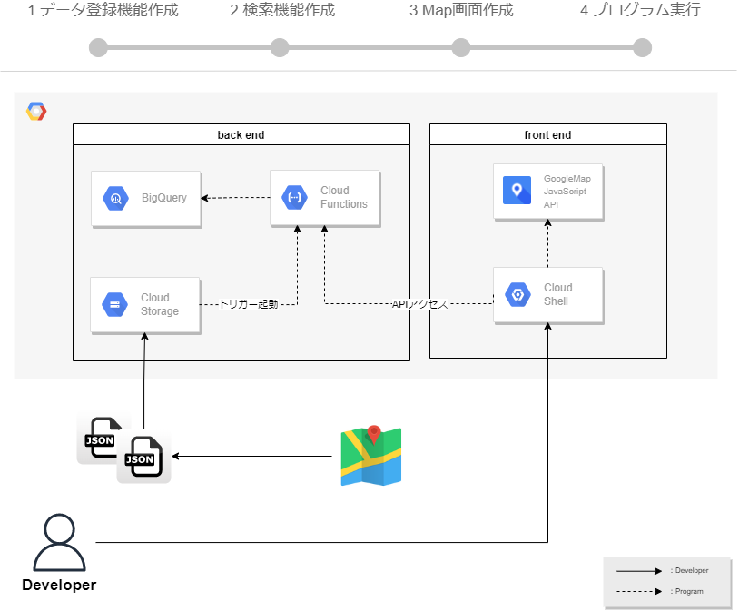

# はじめに  
## 今回のゴール
BigQueryに溜め込んだデータ（住所情報）を、 GoogleMapAPIを使って画面表示します。  
  
データの溜め込みや、画面表示をさせるために、Cloud StorageやCloud Functionsを使用します。  
今回は大きく３機能作成しますが、全てGCPコンソール上の開発で完結出来るハンズオンとなります。  
また、PCへのインストール不要なので、ブラウザ一つで開発するハンズオンを体験頂ければ幸いです。  

   

使用する技術要素については、以下となります。  
※ページの最後に、技術要素の参考サイトを記載しています。  
- フロントエンド
  - TypeScript
  - Node.js
  - Cloud Shell Editer（開発環境兼、実行環境）
- バックエンド
  - JavaScript
  - Node.js
  - Cloud Functions（サーバーレス）
- API
  - GoogleMap JavaScript API
  - BigQuery API
  - Cloud Storage API
- データベース
  - BigQuery
- ストレージ
  - Cloud Storage

## 事前に準備頂きたいこと
- GCPアカウントの作成
  - BigQueryのデータセット作成
  - Cloud Storageのバケット作成

## 手順 
全体手順としては次の流れで進めます。  
 　0.GCPのAPI有効化  
 　1.データ登録機能作成  
 　2.検索機能作成  
 　3.Map画面作成  
 　4.プログラム実行  
 　5.おまけ  
 
## 技術要素
以下は技術要素の参考サイトのリンクです。  
- [GoogleMap JavaScript API](https://developers.google.com/maps/documentation/javascript?hl=ja)
  - [WebGL Overlay (ThreeJS wrapper)](https://developers.google.com/maps/documentation/javascript/examples/webgl/threejs-overlay-simple?hl=ja)のサンプルコードをベースにしています。
- [BigQuery API](https://cloud.google.com/bigquery/docs/reference/libraries-overview)
- [Cloud Storage API](https://cloud.google.com/storage/docs/apis?hl=ja)
- [Cloud Functions](https://cloud.google.com/functions/docs/concepts/overview?hl=ja)
