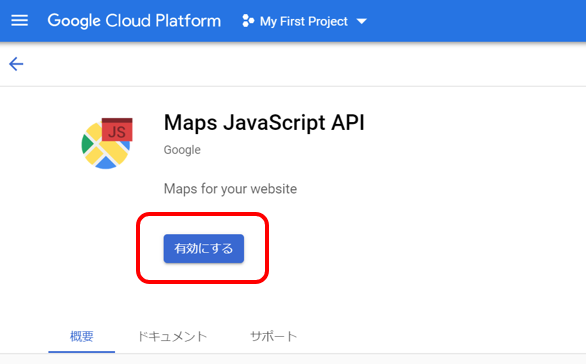

# GCPのAPI有効化
今回のハンズオンで使用するGCPのAPIを有効化します。

----
## GCPアカウントの確認  
1. 以下URLにアクセスし、GCPコンソールへログインします。  
https://console.cloud.google.com/  

2. ダッシュボード画面が表示されることを確認します。  

## GCPのAPI有効化  
1. 以下URLまたは、検索バーから「Maps JavaScript API」と検索し、  
GoogleMap JavaScript APIを有効化します。    
https://console.cloud.google.com/marketplace/product/google/maps-backend.googleapis.com  

     
