# データ登録機能作成  
テストデータは、JSON形式のデータを使用します。  
テストデータはBigQueryに自動で取り込めるようにするため、Cloud Storageに配置されたファイルを  
トリガーとして、プログラムでBigQueryに自動登録するようにします。  
実行環境はCloud Functionsです。  

----
  
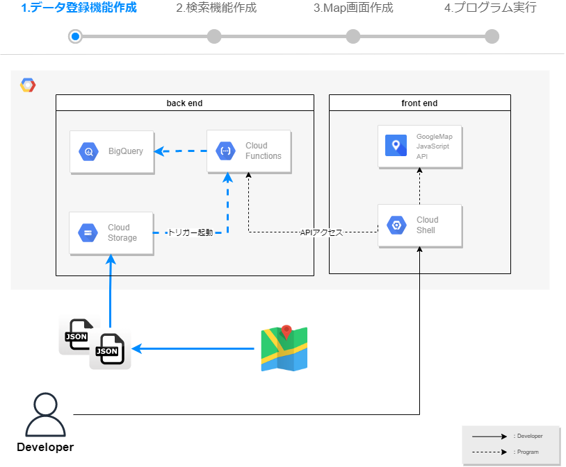 
  
## テストデータ登録機能を作成する
1. 以下URLまたは、検索バーから「Cloud Functions」と検索し、Cloud Functionsを開きます。  
https://console.cloud.google.com/functions/  

2. 『関数の作成』を選択します。
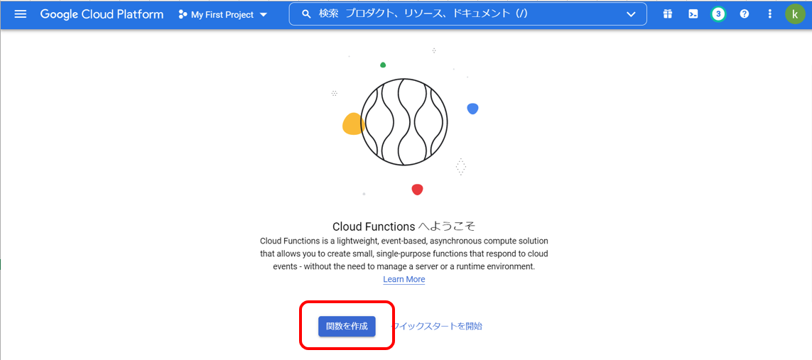   

3. 必要なAPIの有効化が求められるので、『有効にする』を選択します。
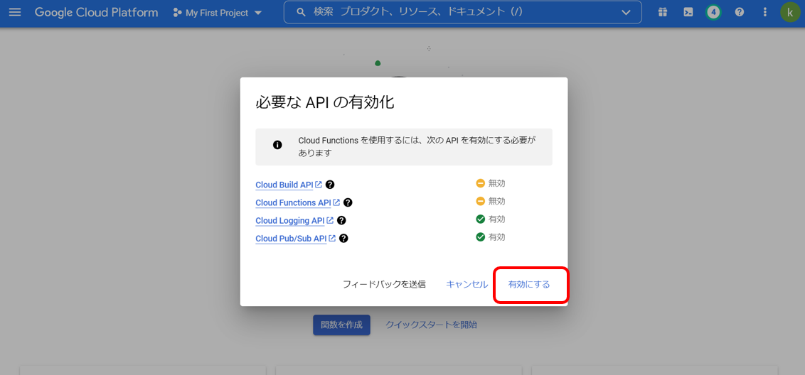   

1. 基本設定とトリガー設定を行い、『保存』を選択します。  
バケットは指定のバケット名に書き換えてください。  
    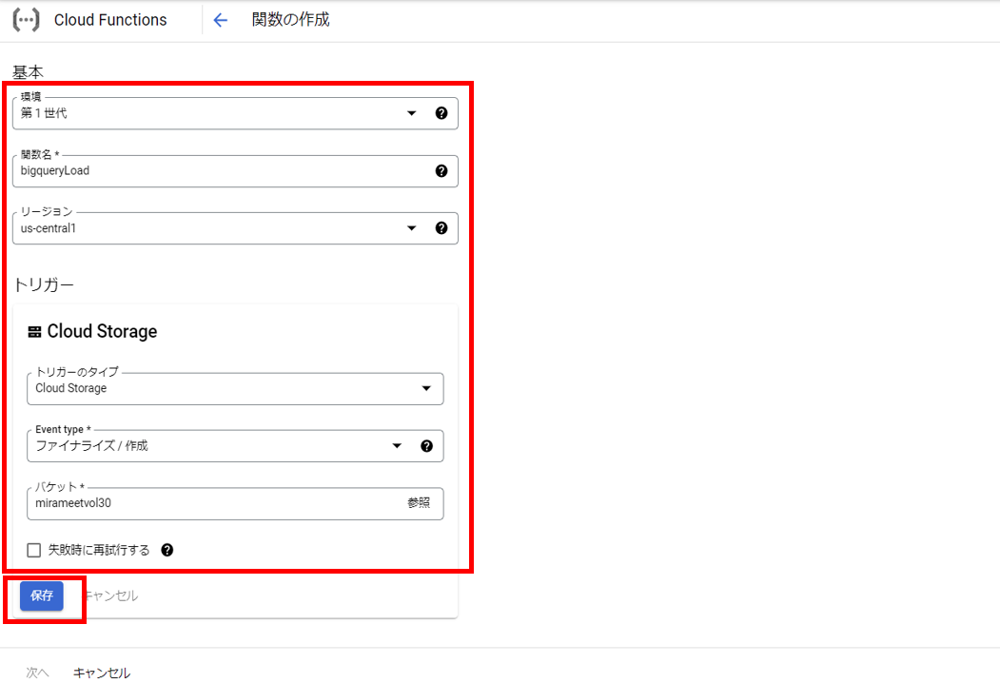   

5. 『次へ』を選択します。   
    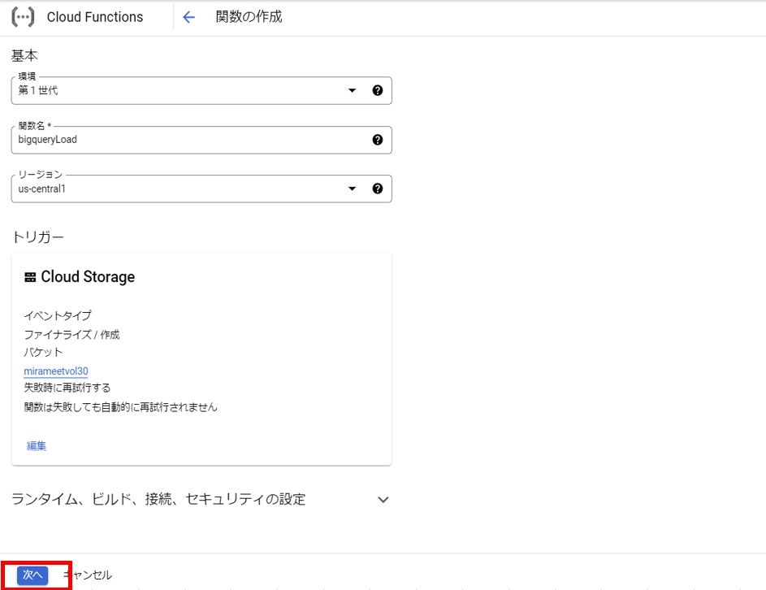   

6. ランタイムは"Node.js 16"を選択します。  

7. index.jsを開き、以下コードに書き換えます。  
【指定のバケット名】と【指定のデータセット名】は指定の値に書き換えます。  
エントリポイントは、JavaScriptのプログラムに合わせ、"main"に変更します。  
 このプログラムは、GCSに配置されたトリガー情報からファイル名を取得し、  
指定のGCSバケットからBigQueryのテーブルにロードを行っています。  
GCSとBigQueryのロケーションは同じである必要があります。  
今回は"us-central1"で統一しています。

    ```
    // import
    const { BigQuery  } = require('@google-cloud/bigquery');
    const { Storage } = require('@google-cloud/storage');
    const bigquery = new BigQuery();
    const storage = new Storage();
      
    exports.main = async (event, context) => {
        const gcsEvent = event
  
        // Cloud Storageのバケット名
        const bucketName = 【指定のバケット名】

        // Cloud Storageのファイル形式
        const metadata = {
            sourceFormat: 'NEWLINE_DELIMITED_JSON',
            schema: {
                fields: [
                    {"name": "type","type": "STRING","mode": "NULLABLE"},
                    {"name": "features","type": "RECORD","mode": "REPEATED",
                    "fields": [
                        {"name": "geometry","type": "RECORD","mode": "REPEATED",
                        "fields": [
                            {"name": "coordinates","type": "NUMERIC","mode": "REPEATED",
                            "fields": []},
                            {"name": "type","type": "STRING","mode": "NULLABLE"}
                        ]},
                        {"name": "properties","type": "RECORD","mode": "REPEATED",
                        "fields": [
                            {"name": "GoogleMapsURL","type": "STRING","mode": "NULLABLE"},
                            {"name": "Location","type": "RECORD","mode": "REPEATED",
                            "fields": [
                                {"name": "Address","type": "STRING","mode": "NULLABLE"},
                                {"name": "BusinessName","type": "STRING","mode": "NULLABLE"},
                                {"name": "CountryCode","type": "STRING","mode": "NULLABLE"},
                                {"name": "GeoCoordinates","type": "RECORD","mode": "REPEATED",
                                "fields": [
                                    {"name": "Latitude","type": "STRING","mode": "NULLABLE"},
                                    {"name": "Longitude","type": "STRING","mode": "NULLABLE"}
                                ]}
                            ]},
                            {"name": "Published","type": "STRING","mode": "NULLABLE"},
                            {"name": "Title","type": "STRING","mode": "NULLABLE"},
                            {"name": "Updated","type": "STRING","mode": "NULLABLE"}
                        ]},
                        {"name": "type","type": "STRING","mode": "NULLABLE"}  
            ]}],},
            location: 'us-central1',
        }
          
        // BigQueryのデータセット名
        const datasetId = 【指定のデータセット名】
          
        // BigQueryのテーブル名
        const tableId = 'TEST_TABLE'
          
        // BigQueryのロード実行
        const [job] = await bigquery
            .dataset(datasetId)
            .table(tableId)
            .load(storage.bucket(bucketName).file(`${gcsEvent.name}`), metadata)
    };
    ```
    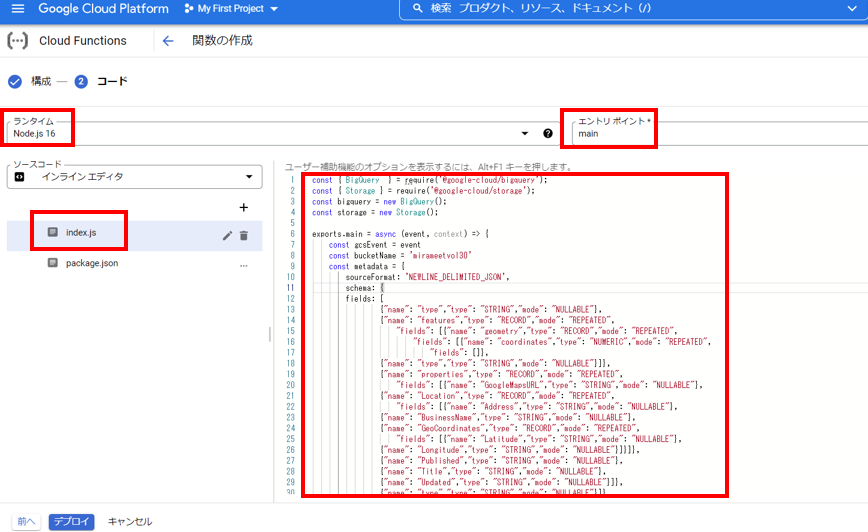   

1. package.jsonを開き、dependenciesにgoogle-cloud/storageとgoogle-cloud/bigQueryを追記します。  
    ```
    {
      "name": "sample-cloud-storage",
      "version": "0.0.1",
      "dependencies": {
        "@google-cloud/storage": "^5.8.1",
        "@google-cloud/bigquery": "^5.10.0"
      }
    }
    ```
    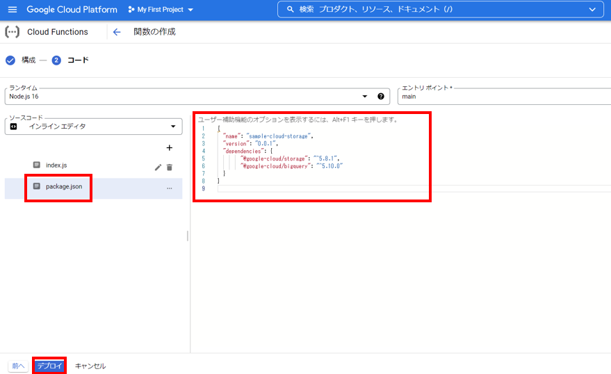   
2.  『デプロイ』を選択し、デプロイされるのを待ちます。  
約１分ほどでデプロイが完了します。  
    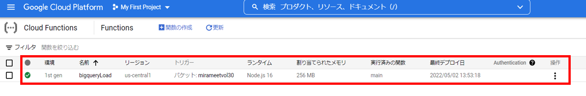  

## テストデータの作成  
※以下手順はテストデータの作成手順ですが、  
　今回のハンズオンでは弊社側で用意したテストデータをお渡ししますので、そちらを利用ください。  
　このJSONデータには、以下２つの住所情報が入っています。  


  [ダウンロードリンク](https://drive.google.com/file/d/1LA-Uh3oEF1iGj_ClTeIVZ7_F9V5iyKuJ/view?usp=sharing)  

- スカイツリー
- 東京タワー

----

1. GoogleMapを開きます。  
https://www.google.co.jp/maps  

2. お気に入りの場所を選択し、『スター付き』を選択します。  
       

3. 複数スターを付けていきます。  

4. Googleデータエクスポートを開きます。  
https://takeout.google.com/settings/takeout  
「選択をすべて解除」選択し、「マップ（マイプレイス）」のみ選択します。  
    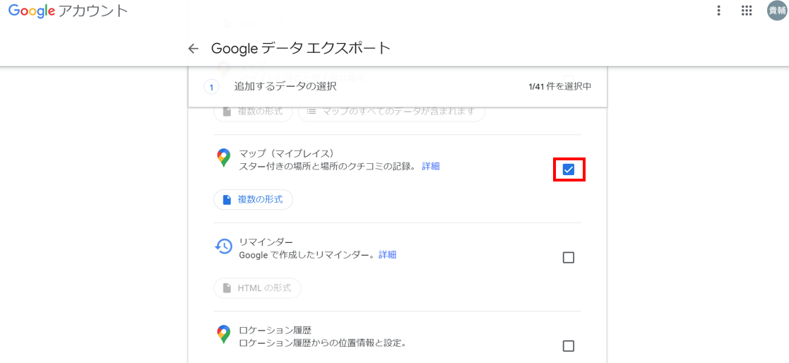   

5. 「次のステップ」　＞　「エクスポート作成」をクリックします。  

6. 「ダウンロード」をクリックします。  

7. ダウンロードしたZIPファイルを解凍し、JSON形式でスターを付けた情報が存在することを確認します。  

8. ダウンロードしたJSONデータですがカラム名にスペースが混在しており、BigQueryとしては都合が悪いため、置換して削除します。  
以下コマンドをGitBash等のTerminalで実行します。
    ```
    cd *JSONデータをダウンロードしたディレクトリ

    sed -z 's/\n//g' 保存した場所.json | sed -z 's/Google Maps URL/GoogleMapsURL/g' | sed -z 's/Business Name/BusinessName/g' | sed -z 's/Geo Coordinates/GeoCoordinates/g' | sed -z 's/Country Code/CountryCode/g' > test_data.json
    ```

## テストデータを登録する
1. 以下URLまたは、検索バーから「Cloud Stroage」と検索し、Cloud Stroageを開きます。    
https://console.cloud.google.com/storage/browser  

1. 先ほどのプログラムに書き加えたバケット名を選択します。

2. 『ファイルをアップロード』を選択し、"test_data1.json"をアップロードします。  
アップロード完了後、作成したCloud Functionsがアップロードされたファイルをトリガーに、BigQueryへ登録されます。  
    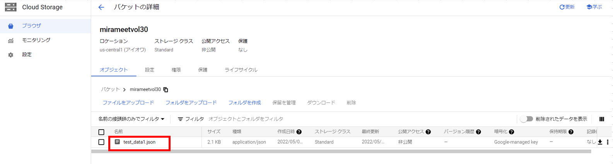   

4. 以下URLまたは、検索バーから「BigQuery」と検索し、BigQueryを開きます。
https://console.cloud.google.com/bigquery

5. 『クエリを新規作成』を選択し、  
SQLエディターから、SELECT文を実行しテストデータが登録されているかを確認します。  
    ```
    SELECT * FROM *指定のデータセット名.TEST_TABLE
    ```
    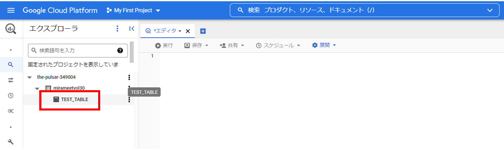   

