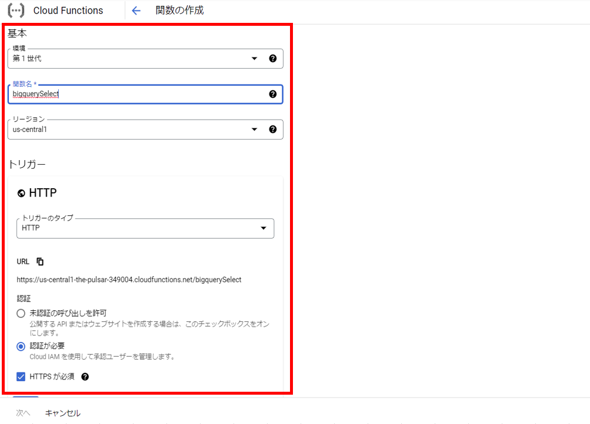

# 検索機能作成  
BigQueryに登録したデータを検索するプログラムを作成します。  
このプログラムは、リクエストパラメータで渡された検索条件でSELECT文を作成し、  
BigQuery APIを用いてBigQueryのデータを検索します。  
検索結果には、緯度・経度情報を取得してレスポンス情報として、返却します。  
実行環境はCloud Functionsです。  

----
  
 
  
## 検索機能を作成する
1. 以下URLまたは、検索バーから「Cloud Functions」と検索し、Cloud Functionsを開きます。  
https://console.cloud.google.com/functions/  

2. 『関数の作成』を選択します。  

3. 基本設定とトリガー設定を行い、『保存』を選択します。  
    

4. 『次へ』を選択します。 
       

5. ランタイムは"Node.js 16"を選択します。

6. index.jsを開き、以下コードに書き換えます。  
【指定のデータセット名】はご自身のGCP環境に合わせた値に書き換えます。  
エントリポイントは、JavaScriptのプログラムに合わせ、"main"に変更します。  
let queryでSELECT文を作成します。BigQueryに登録したデータはJSON形式のため、  
UNNESTを使用して緯度経度情報を取得するSELECT文です。  
  
bigquery.createQueryJobでSELECT文をBigQueryに発行します。  
レガシーSQLを使用する場合は、useLegacySqlを"true"に設定してください。  

    ```
    // import
    const { BigQuery } = require('@google-cloud/bigquery');
    const bigquery = new BigQuery();
      
    exports.main = (req, res) => {

        // SQL文作成
        let query = "SELECT Latitude,Longitude "+
                    "FROM ( "+
                    "  SELECT GeoCoordinates "+
                    "  FROM ( "+
                    "    SELECT Location "+
                    "    FROM ( "+
                    "      SELECT properties "+
                    "      FROM 【指定のデータセット名】.TEST_TABLE "+
                    "      ,UNNEST(features) "+
                    "    ),UNNEST(properties) "+
                    "  ),UNNEST(Location) ";
        if (req.query.address != null) {
            query = query + 
                    " WHERE BusinessName LIKE '%" + req.query.address +
                    "%' ),UNNEST(GeoCoordinates) LIMIT 1";
        } else {
            query = query + " ),UNNEST(GeoCoordinates) LIMIT 1";
        }
          
        // SQLオプション設定
        const options = {
            query: query,
            useLegacySql: false,
        };
          
        // SELECT実行
        bigquery.createQueryJob(options)
            .then(results => {
                const [job] = results;
                return job.getQueryResults();
            })
            .then(results => {
                const [rows] = results;
                res.header('Access-Control-Allow-Origin', "*");
                res.header('Access-Control-Allow-Headers', "Origin, X-Requested-With, Content-Type, Accept");
                res.status(200).send(rows);
            })
            .catch(error => {
                console.log(error);
            });
    }
    ```
      

1. package.jsonを開き、dependenciesにgoogle-cloud/bigQueryを追記します。
    ```
    {
      "name": "sample-http",
      "version": "0.0.1",
      "dependencies": {
        "@google-cloud/bigquery": "^5.10.0"
      }
    }
    ```
       
2.  『デプロイ』を選択し、デプロイされるのを待ちます。  
約１分ほどでデプロイが完了します。

3.  作成したCloud Functions を選択します。
       

4.   画面からのアクセスを許可します。  
『権限』タブから『追加』を選択し、alluserで"Cloud Functions開発者"の権限を付け、  
『保存』を選択します。  
"リソースの一般公開"の確認が求められるので、『一般アクセスを許可』を選択します。  
       
       

## 動作確認
1. 『トリガー』タブから、『トリガーURL』を選択して動作確認をします。  
       

2. テストデータはスカイツリーと、東京タワーの二つが登録されているので、  
リクエストパラメータに"?address=スカイツリー"のように検索値を渡すことで、  
BigQueryの検索結果が変わることが確認できます。  
また、テストデータの存在しない条件の場合は、NULLが返却されていることがわかります。  
     