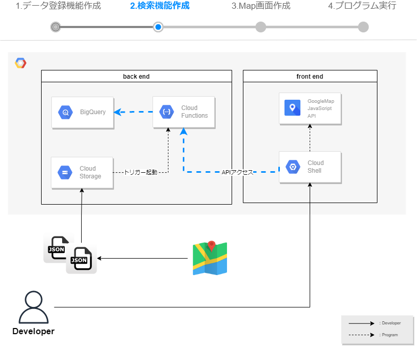
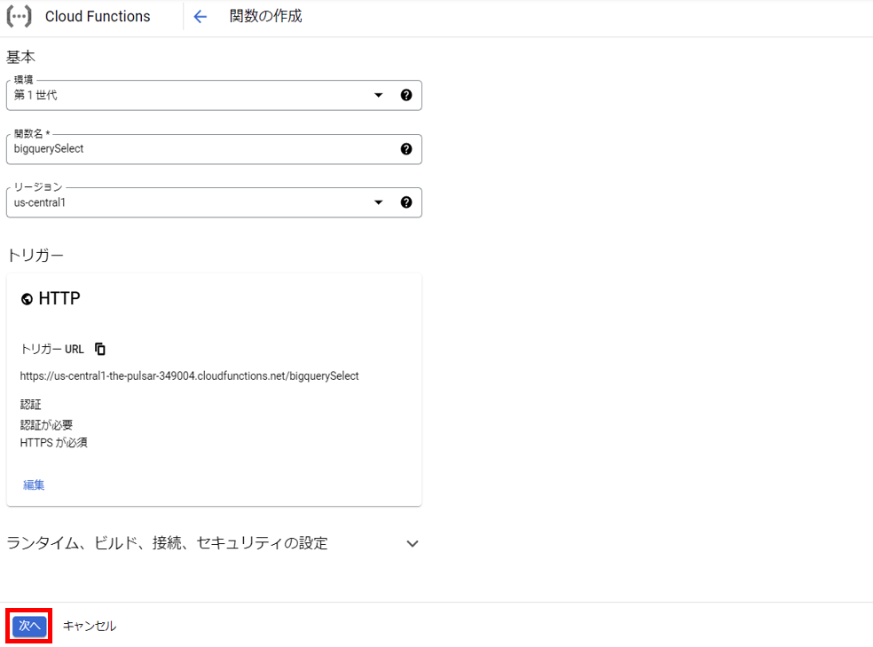
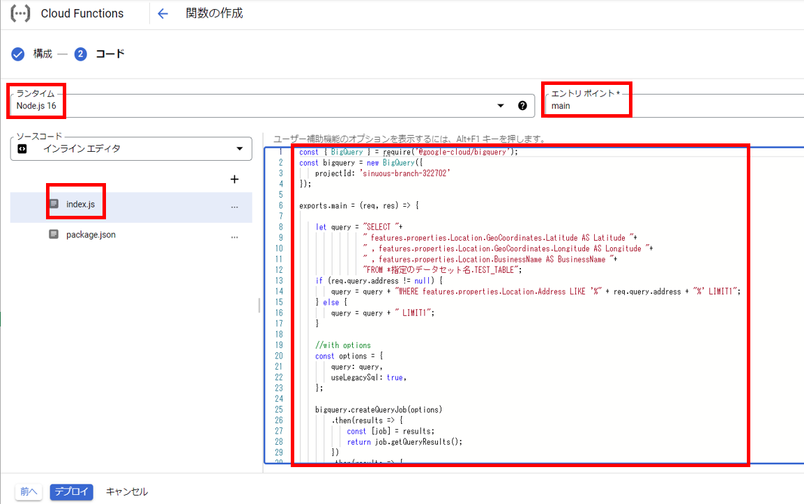
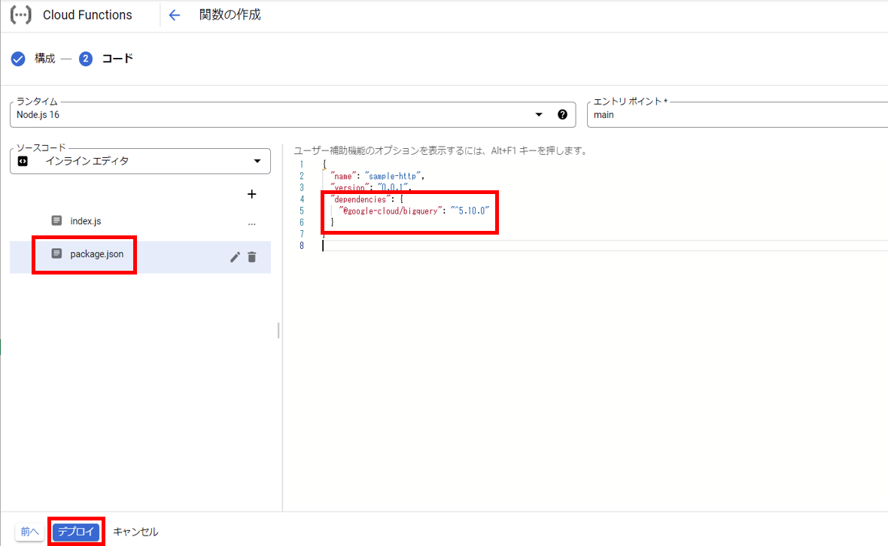
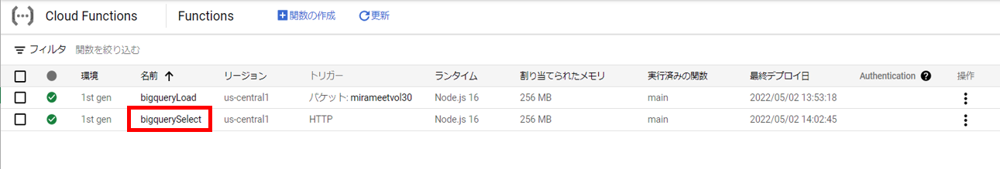
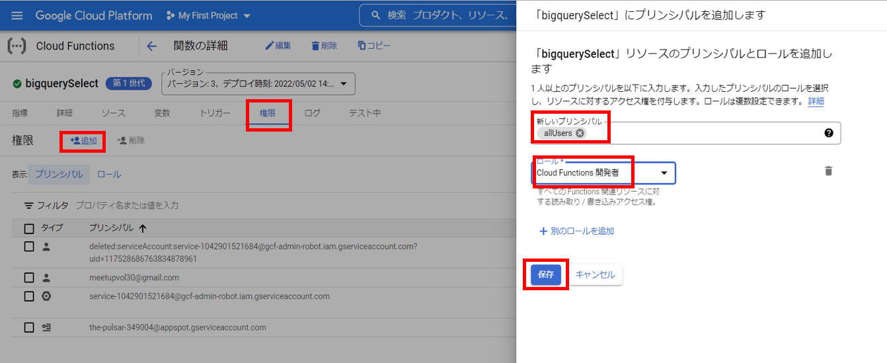
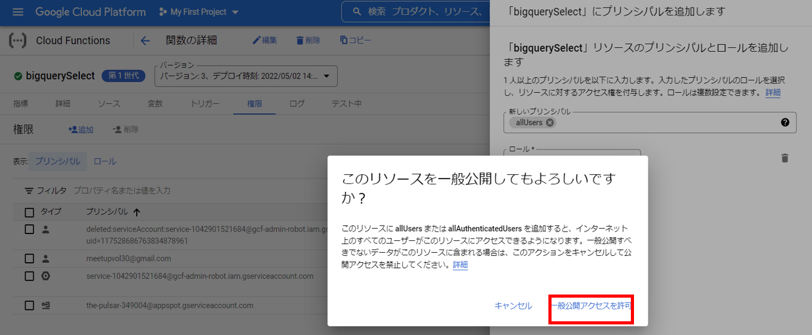
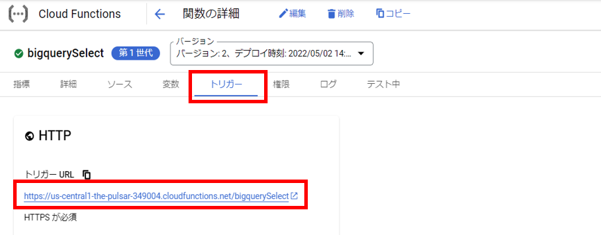
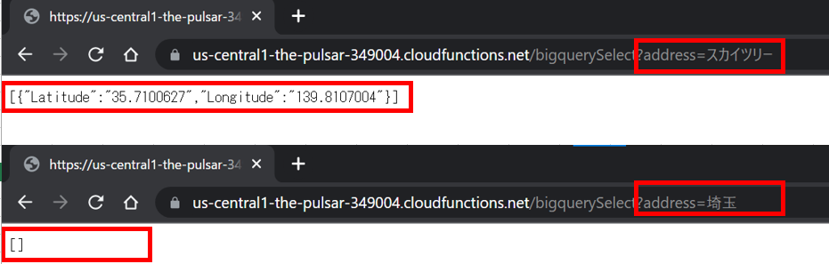

# 検索機能作成  
この手順では、BigQueryを検索するプログラムをJavaScriptで作成します。  
また、作成したプログラムはNode.Jsで実行するため、サーバーレスで実行可能なCloud Funcitonにデプロイしていきます。  

 
----
## 検索機能を作成する
1. Cloud Functionを開きます。  
https://console.cloud.google.com/functions/  
2. 『関数の作成』を選択します。
3. 以下設定内容で、基本設定とトリガー設定を行います。  
※以下以外は全てデフォルト設定

    |  設定項目  |  設定値  |
    | ---- | ---- |
    |  環境  |  第１世代  |
    |  関数名  |  bigquerySelect  |
    |  リージョン  |  us-central1  |
    |  トリガータイプ  |  HTTP  |

4. 『保存』→『次へ』を選択します。 
       
5. ランタイムは"Node.js 16"を選択します。
6. index.jsを開き、以下コードに書き換えます。  
エントリポイントは、JavaScriptのプログラムに合わせ、"main"に変更します。  
このプログラムは、リクエストパラメータを条件に、SELECT文を作成し、BigQuery APIを用いてBigQueryのデータを検索しています。  
検索結果はレスポンス情報として、返却します。  
       
   - ソースコード
    ```
    const { BigQuery } = require('@google-cloud/bigquery');
    const bigquery = new BigQuery();

    exports.main = (req, res) => {
        
        let query = "SELECT "+
                    "  Latitude,Longitude "+
                    "FROM ( "+
                    "  SELECT "+
                    "    GeoCoordinates "+
                    "  FROM ( "+
                    "    SELECT "+
                    "      Location "+
                    "    FROM ( "+
                    "      SELECT"+
                    "        properties"+
                    "      FROM 【指定のデータセット名】.TEST_TABLE"+
                    "      ,UNNEST(features)"+
                    "    ),UNNEST(properties) "+
                    "  ),UNNEST(Location) ";
        if (req.query.address != null) {
            query = query + " WHERE BusinessName LIKE '%" + req.query.address + "%' ),UNNEST(GeoCoordinates) LIMIT 1";
        } else {
            query = query + " ),UNNEST(GeoCoordinates) LIMIT 1";
        }

        //with options
        const options = {
            query: query,
            useLegacySql: true,
        };
        
        bigquery.createQueryJob(options)
            .then(results => {
                const [job] = results;
                return job.getQueryResults();
            })
            .then(results => {
                const [rows] = results;
                res.header('Access-Control-Allow-Origin', "*");
                res.header('Access-Control-Allow-Headers', "Origin, X-Requested-With, Content-Type, Accept");
                res.status(200).send(rows);
            })
            .catch(error => {
                console.log(error);
            });
    }
    ```
7. package.jsonを開き、dependenciesにgoogle-cloud/bigQueryを追記します。
    ```
    {
      "name": "sample-http",
      "version": "0.0.1",
      "dependencies": {
        "@google-cloud/bigquery": "^5.10.0"
      }
    }
    ```
       
8.  『デプロイ』を選択し、デプロイされるのを待ちます。約１分ほどでデプロイが完了します。
9.  作成したCloud Function を選択します。
       
10. 権限から『追加』を選択します。  
alluserで"Cloud Function開発者"の権限を付け、『保存』を選択します。  
"リソースの一般公開"の確認が求められるので、『一般アクセスを許可』を選択します。  
       
       

## 動作確認
1. 作成したCloud Function を選択し、トリガーURLから動作確認をします。  
       
2. リクエストパラメータがBigQueryの検索条件になりますが、条件にヒットしない場合、NULLが返却されていることがわかります。  
     