# Map画面作成  
Maps JavaSciript APIを使い、BigQueryの情報を絞り込んでマップにピン止めするプログラムを作成します。  
このプログラムは、トリガーURL（手順2.で作成した機能）にアクセスして、  
検索結果が取得出来たら、Maps JavaScrit APIを使って画面描写をします。  
開発環境と実行環境はCloud Shell Editerです。  

----
 
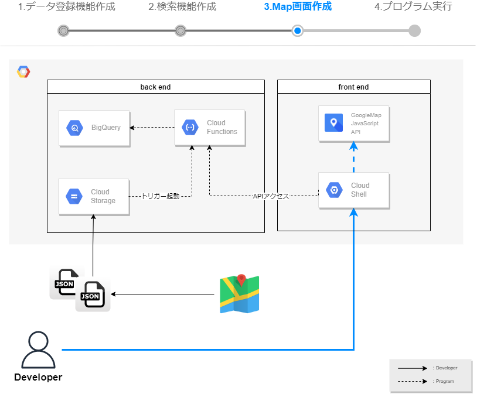 
  
## ソースコードの取得  
1. 以下URLより、Google社が提供しているSampleコードを取得します。  
https://ssh.cloud.google.com/cloudshell/editor?cloudshell_git_repo=https%3A%2F%2Fgithub.com%2Fgooglemaps%2Fjs-samples&cloudshell_git_branch=sample-threejs-overlay-simple&cloudshell_tutorial=cloud_shell_instructions.md&cloudshell_workspace=.&hl=ja  

1. Cloud Shell Editerが起動され、説明文が表示されます。  
『続行』を選択します。

2. Cloneするソースコードのリポジトリの確認が求められたら、『確認』を選択します。
    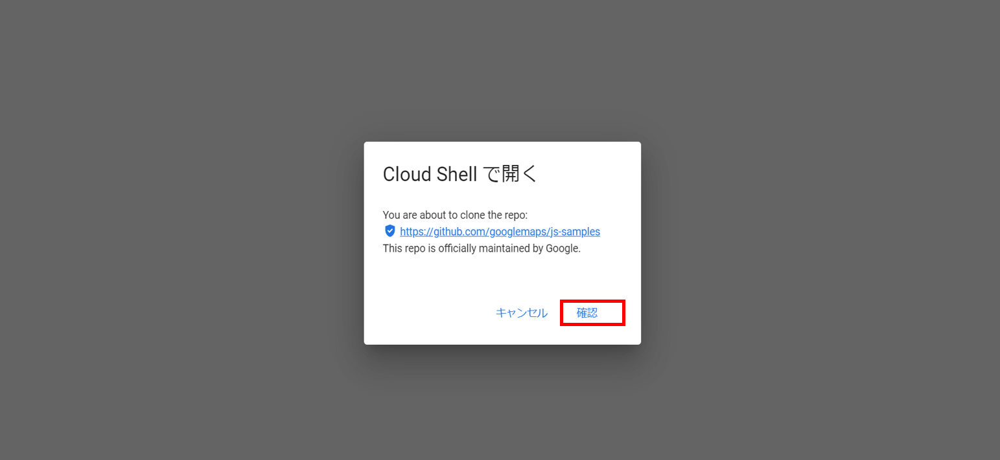   

3. Cloud Shell Editerが起動され、Smapleコードのプロジェクトが開いていることを確認します。
    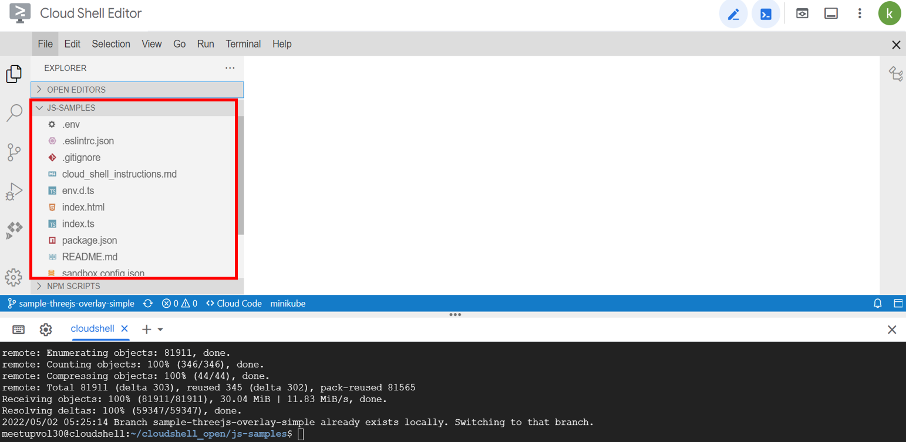   

## Map画面を作成する。
1. Cloud Shell Editerからindex.tsを開き、以下コードに書き換えます。  
ソースコードの【トリガーURL】の部分は、  
手順[2.]のCloud Functionsで作成したbigquerySelectのトリガーURLを記載します。  

立体的な地図描写を実現するGLTFLoaderを使用します。  

Cloud FunctionsのプログラムをトリガーURLに指定してHTTPアクセスを行い、  
BigQueryから緯度経度情報を取得します。  

mapOptionでは、描写の設定が可能です。  
緯度経度情報の設定や、倍率を設定できます。  


    ```
    // import
    import * as THREE from "three";
    import { GLTFLoader } from "three/examples/jsm/loaders/GLTFLoader";
    import { ThreeJSOverlayView } from "@googlemaps/three";
    let map: google.maps.Map;
      
    function initMap(): void {
    let url = new URL(window.location.href);
    let params = url.searchParams;
    let triggerUrl=`【トリガーURL】`;
    if (params.get('address') != null) {
        triggerUrl=triggerUrl+`?address=`+params.get('address');
    } 
    let mapOptions;
    let data = new Array();

    // Cloud FunctionsのSELECT結果取得
    fetch(triggerUrl)
    .then(response => {
        console.log(response.status);
        response.json().then(userInfo => {
            for (var i = 0; i < userInfo.length; i++) {

                // MapAPIのオプション設定
                mapOptions = {
                    tilt: 0,
                    heading: 0,
                    zoom: 18,
                    center: { lat: Number(userInfo[i].Latitude), lng: Number(userInfo[i].Longitude) },
                    mapId: "15431d2b469f209e",
                    disableDefaultUI: true,
                    gestureHandling: "none",
                    keyboardShortcuts: true,
                };
                const mapDiv = document.getElementById("map") as HTMLElement;
                map = new google.maps.Map(mapDiv, mapOptions);
                const scene = new THREE.Scene();
                const ambientLight = new THREE.AmbientLight(0xffffff, 0.75);
                scene.add(ambientLight);
                const directionalLight = new THREE.DirectionalLight(0xffffff, 0.25);
                directionalLight.position.set(0, 10, 50);
                scene.add(directionalLight);
                 
                // Load the model.
                const loader = new GLTFLoader();
                const url =
                    "https://raw.githubusercontent.com/googlemaps/js-samples/main/assets/pin.gltf";
                      
                loader.load(url, (gltf) => {
                    gltf.scene.scale.set(10, 10, 10);
                    gltf.scene.rotation.x = Math.PI / 2;
                    scene.add(gltf.scene);
                    let { tilt, heading, zoom } = mapOptions;
                      
                    const animate = () => {
                    if (tilt < 67.5) {
                        tilt += 0.5;
                    } else if (heading <= 360) {
                        heading += 0.2;
                        zoom -= 0.0005;
                    } else {
                        // exit animation loop
                        return;
                    }
                      
                    map.moveCamera({ tilt, heading, zoom });
                    requestAnimationFrame(animate);
                    };   
                    requestAnimationFrame(animate);
                });
                new ThreeJSOverlayView({
                    map,
                    scene,
                    anchor: { ...mapOptions.center, altitude: 100 },
                    THREE,
                });
            };
        });
    });
    }
      
    declare global {
    interface Window {
    initMap: () => void;
    }
    }
    window.initMap = initMap;
    export { initMap };
    ```
    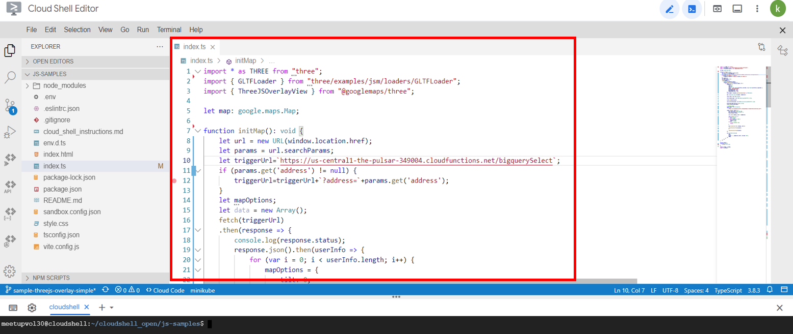   

1. ターミナルから、以下コマンドを実行し、npmを初期化します。
    ```
    npm i 
    ```

## 動作確認
1. ターミナルから、以下コマンドを実行し、アプリケーションを起動します。  
    ```
    npm start
    ```
2. ターミナル上の実行ログに表示される "http://localhost:3001/" を  
クリック（またはCtrl + クリック）し、  動作確認を行います。  
    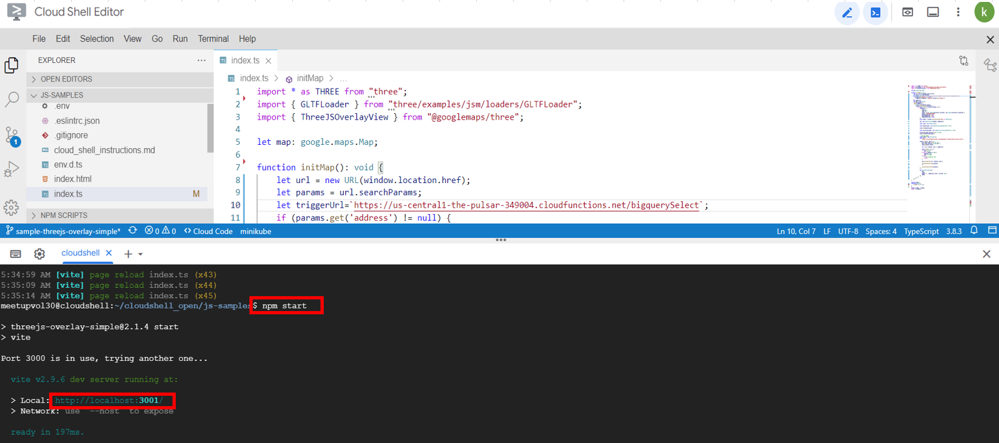   

3. 登録した地図情報が表示されることを確認します。
    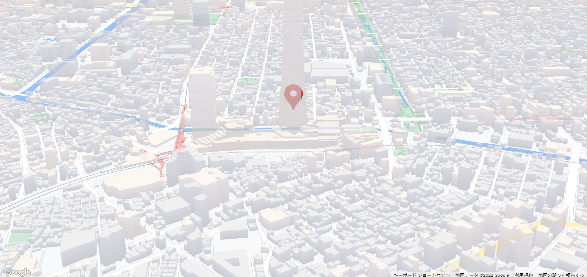   

4. リクエストパラメーターを付け加え、検索条件値を入れて条件を絞ってみましょう。  
検索条件に応じて東京タワーやスカイツリーが表示されるかと思います。  
    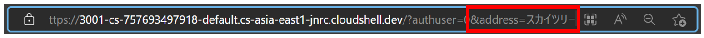   
※パラメータ内容
    ```
    &address=東京タワー
    ```
    ```
    &address=スカイツリー
    ```

## スタイルの変更
1. Maps JavaScript APIではレイアウトの変更がプログラム修正なしで可能です。  
以下、URLにアクセスし、マップIDを作成します。  
https://console.cloud.google.com/google/maps-apis/studio/maps

2. 『マップIDを作成』を選択します。  
    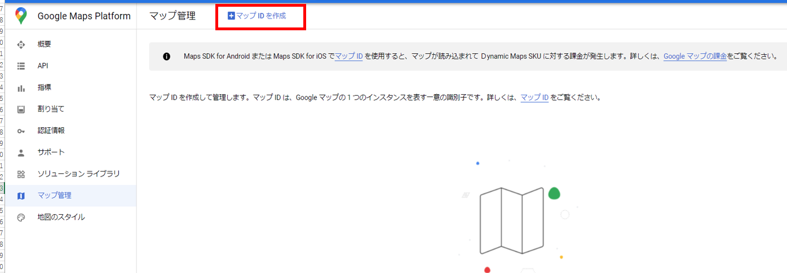   

3. 以下設定内容で、『保存』を選択します。
    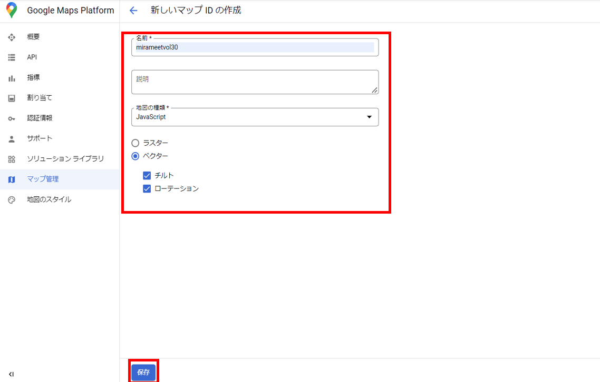   

4. スタイルを作成します。  
左メニューから『地図のスタイル』を選択し、『スタイルを作成』を選択します。
    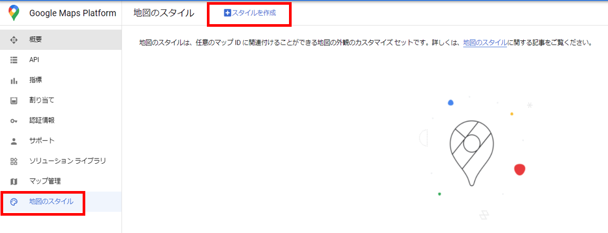   

5. バリエーションから任意のレイアウトを選択し、  
スタイルの名前を入力して『保存』を選択します。  
※デフォルトでもOKです。  
    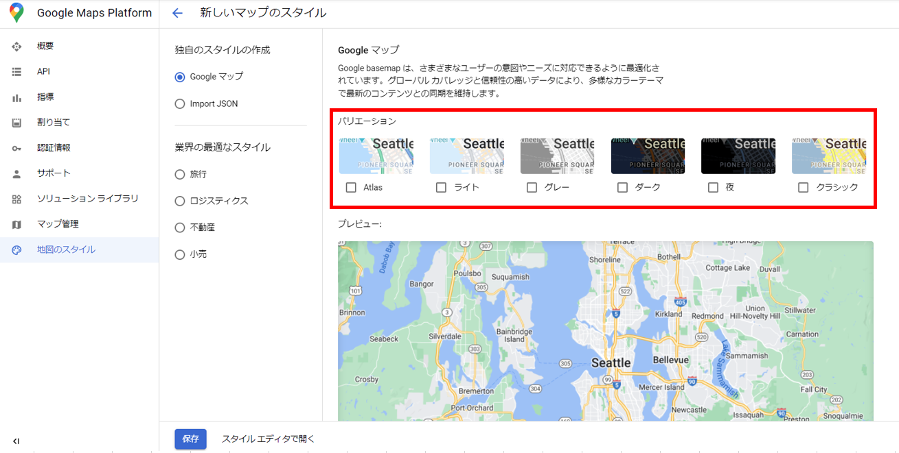  
    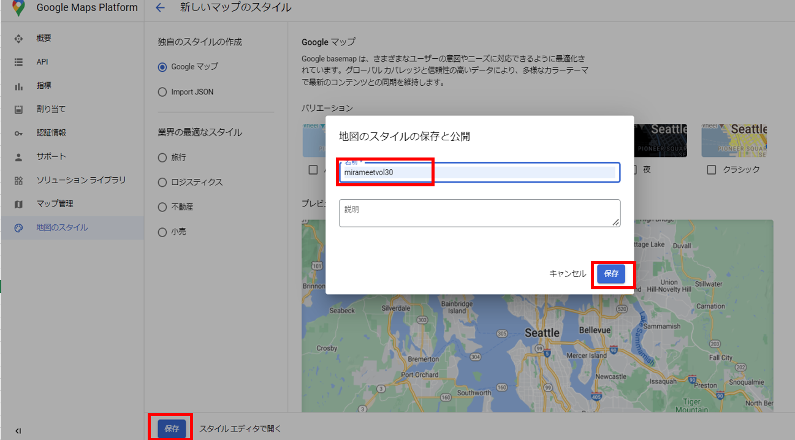   

1. 『ADD MAP IDS』を選択し、先ほど作成したマップIDに紐づけます。
    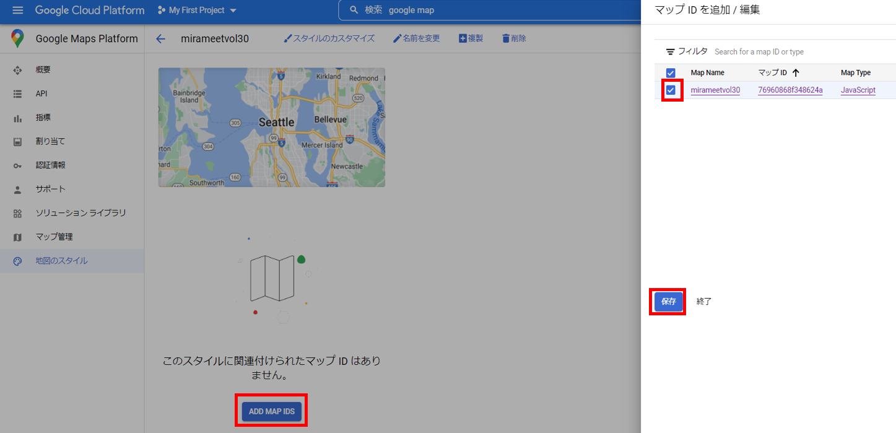   

2. 左メニューから『マップ管理』を選択し、先ほどのマップIDをコピーし、再度Cloud Shell Editerを開きます。  
    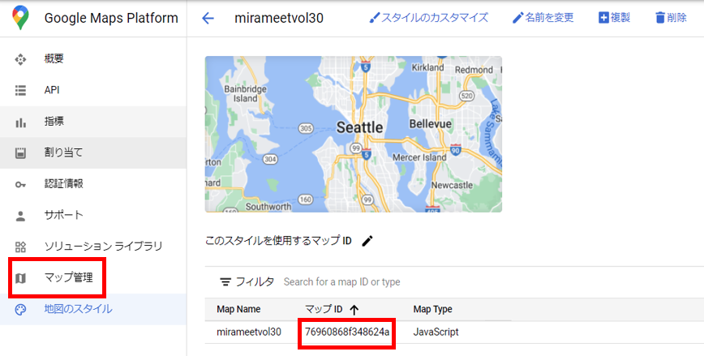   

3. index.tsを開き、mapOptionsのmapIdに作成したマップIDに書き換え、保存します。
    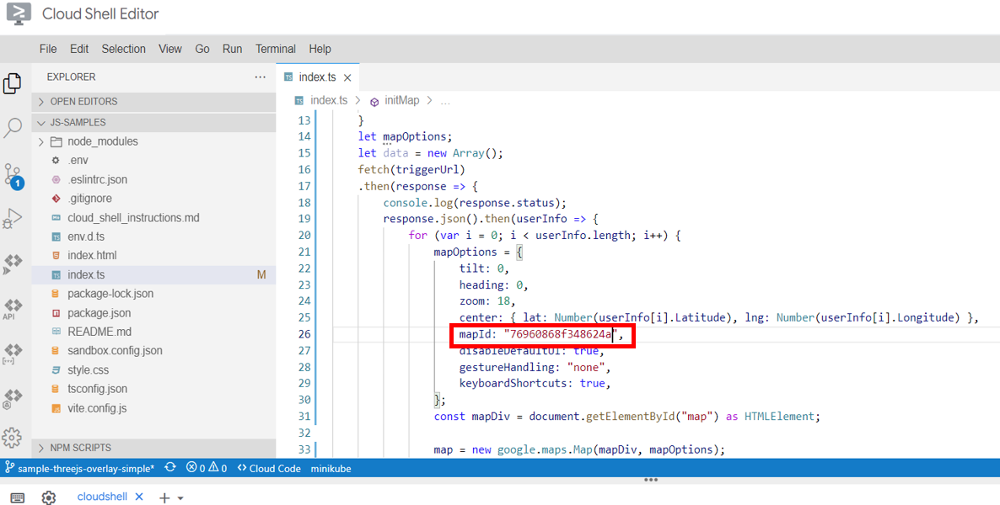   
