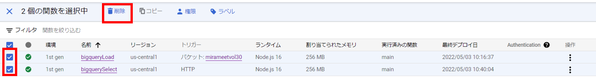
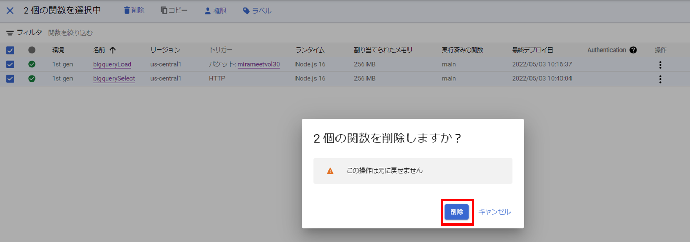
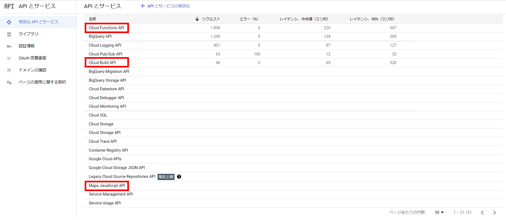
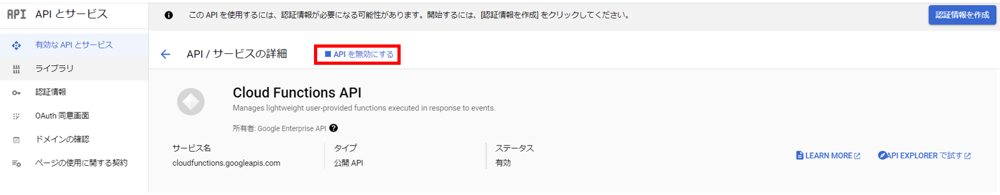
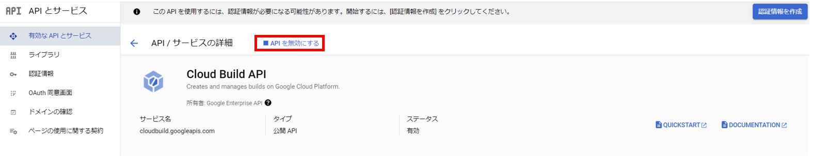
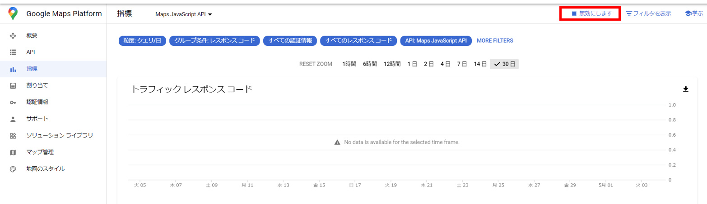

# おまけ  
最後に、APIの無効化と作成Cloud Functionsを削除をします。  

※無料期間が終了しても自動で課金されることはありません  
　GCP内をCleanUpしたい方は以下手順を行ってください  

----
## Cloud Functionsの削除
1. 以下URLまたは、検索バーから「Cloud Functions」と検索し、Cloud Functionsを開きます。  
https://console.cloud.google.com/functions/  

2. 「bigquerySelect」にチェックボックスを入れ、『権限』を選択します。  
       

3. 「Cloud Functions 開発者」から、allUsersの『ゴミ箱マーク』を選択します。
       

4. 削除の確認が求められるので、『削除』を選択します。
       

5. 作成したCloud Functions にチェックを入れ、『削除』を選択します。
       

6. 削除の確認が求められるので、『削除』を選択します。
       

## GCPのAPI無効化  
1. 以下URLまたは、検索バーから「APIとサービス」と検索し、APIとサービス画面を表示します。  
https://console.cloud.google.com/apis/dashboard

1. 以下APIを選択します。  
   - Cloud Functions API
   - Cloud Build API
   - Maps JavaScript API

       

2. 各APIの画面で『APIを無効化する』、または『無効にします』を選択します。
       

       

       
