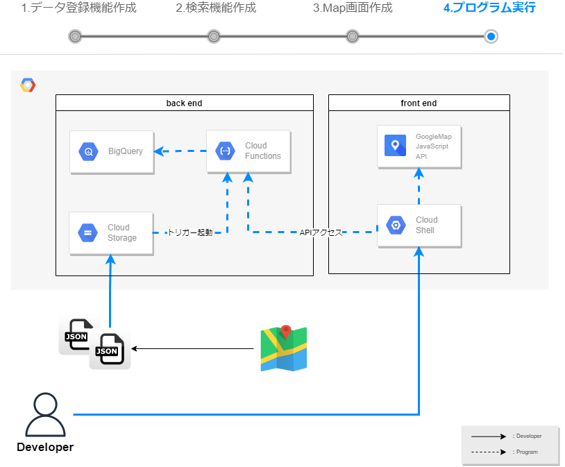
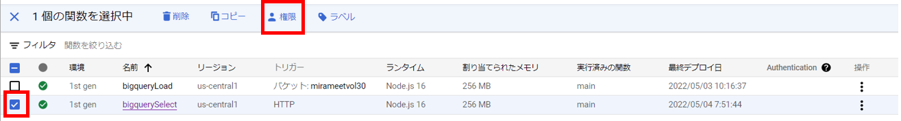
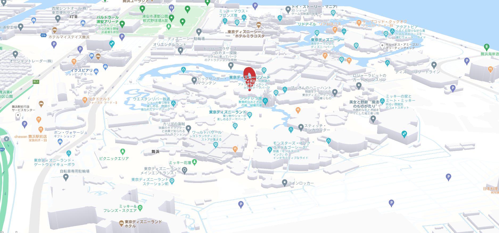

# プログラム実行  
作成したプログラム実行し、一連の流れで最終確認を行っていきます。  
実行環境はCloud Shell Editerです。  

----
 
 
  
## 動作確認
1. 再度、Cloud Storageに追加のJSONデータを配置します。  
既に２件のデータ（スカイツリー、東京タワー）が登録されているので、追加で３件のデータを  
登録し、５件のデータが検索出来ることと  検索結果に応じた画面表示できることを確認します。  
追加のJSONデータは、以下リンクよりダウンロードください。   
以下３つの住所情報が入っています。  
[ダウンロードリンク](https://drive.google.com/file/d/1X8QXCKnN_sWgWR83a_F7JPSo9FXAedN6/view?usp=sharing)    
   - ディズニーランド
   - ユニバーサルスタジオジャパン
   - エトワール凱旋門
       

2. Cloud Shell Editerから、 "http://localhost:300x/" を開きます。  
※port（300x）は人によって異なります。  
　もし、npm startを実行していない場合は、ターミナルよりnpm startコマンドの上、  
　localhostにアクセスください。  


3. 追加の３件のデータをリクエストパラメータで検索してみましょう。  
※【URL】の部分は各GCPアカウントによって異なります。  
    ```
    例）
    　https://【URL】&address=ディズニー
    　https://【URL】&address=ユニバーサル
    ```  
検索条件に応じて東京タワーやスカイツリーが表示されるかと思います。  
また、前手順で設定したスタイル設定も反映されていることを確認します。  
       
